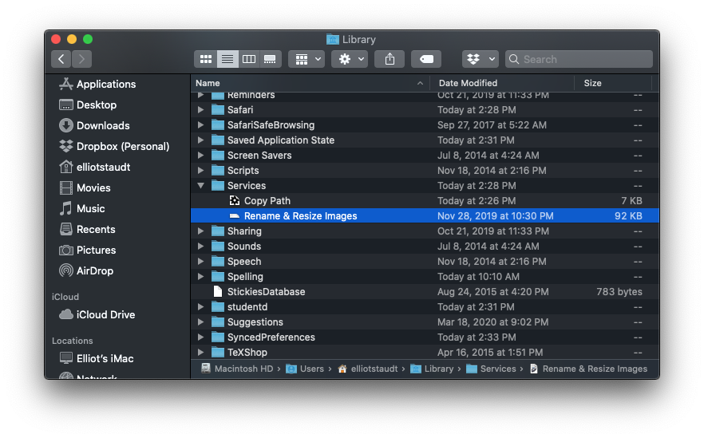
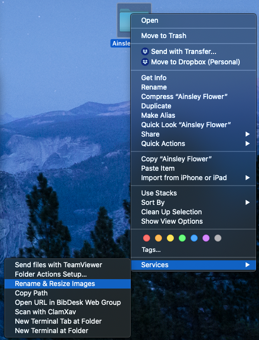

# Rename and Resize Images
This program operates on a folder of images. When you right click on a folder, A simple script for resizing images within a folder and then renaming them with some variation of the folder name.

## Requirements
### Script
* Python 3.6+
* PIL package
```
pip3 install --upgrade pillow
```

### Automator
* Mac OSX 10.9 or later

## Installation
Make sure you have python3.6+ installed on your computer. I believe this is standard on later versions of OSX. Pip install pillow as mentioned above.

Double click on the workflow. You will be asked if you want to save the service 'Rename & Resize Images' to your computer to make it available to Finder. Click 'yes'. The workflow will disappear and install itself on your machine.

Open Automator and open the recently installed workflow inside it. If you have trouble finding it, it is located in the ```~/Libary/Services/``` folder.



The workflow references the python script included in this repository. Move the python script to an appropriate location. Then change the reference in the workflow to reflect the location in which the python script is stored.

At this point you should have a working service to operate on folders.

## Usage
Right click a folder of images. You will see a service called "Rename & Resize Images" in the Service menu.



Click this and all images inside the folder will be renamed to some variation of the folder name and resized to be sure the largest edge is no larger than 2048. This size can be changed in the python script. Enjoy!

## Contact
Elliot Staudt
estaudt@gmail.com